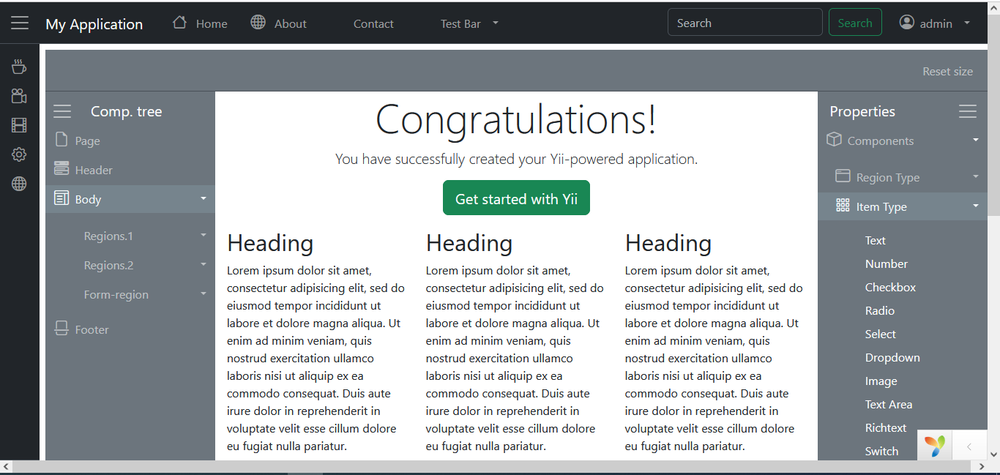

## <span style="color:red;">Yii-Utils</span><br>là kho tiện ích dành cho Yii-Framework (v2.0.49 trở lên)


**Tác giả:** Phi Hùng - vmkeyb908@gmail.com - (VN) 0974 471 724


---


* Widget NavMenu và NavBar được sử dụng với dữ liệu được lấy từ DB
* Sử dụng đơn giản - chỉ cần đặt đoạn mã ở nơi muốn hiển thị Menu/Bar
* Khi đặt đoạn mã, sẽ có nhiều tùy chọn nhằm phù hợp với yêu cầu của bạn.


>*Chú thích:* Widget sử dụng jquery-widget, html-bootstrap5,  bootstrap-icon (ex: `<i class="bi bi-globe"></i>`)
>
>Mọi thắc mắc, bạn có thể trao đổi qua email hoặc liên hệ ĐT để được tư vấn.





>**Cài đặt:**
>
>```markdown
>composer require yii-utils/hwg-nav "dev-master"
>```

---

#### A- Cấu hình main.php:

```copy
1-
'aliases' => [
              //...
              '@Hwg' => '@vendor/Yii-Utils/hwg-nav', // or your/path/extracted/to
              //...
2-
'module' => [
             //...
             'hwg' => [
                        'class' => Hwg\Module::class,
            	      ],
              //...
			  
```

#### B- layout/main.php (template):

```

<!-- ... thay thế navbar trong thẻ header: -->

<header>
    <?php 
		echo Hwg\hwgNav::widget(['id' => 'b_' . preg_replace('/[^a-z]+/','',Yii::$app->homeUrl),
					'brandLabel' => Yii::$app->name,
					'brandUrl' => Yii::$app->homeUrl,
					'classFixed' => 'fixed-top',
					'branchName' => 'NavBar',
					'keyChild' => 'items',
					'map' => ['name' => 'label', 'route' => 'url'],
					'keyEncode' => null,
					'clientOptions' => ['flatMenu' => true ],
				]);
    ?>
</header>


<!-- thay đổi thẻ main ( thêm menu ở thẻ div.col-10.col-sm-3 )  -->

<main role="main" class="flex-shrink-0">
	<div class="row gx-0">
		<div class="col-10 col-sm-3 d-none" style="width:20%">
			<?php
				echo Hwg\hwgNav::widget(['id' => 'm_' . preg_replace('/[^a-z]+/','',Yii::$app->homeUrl),
						'brandLabel' => Yii::$app->name,
						'brandUrl' => Yii::$app->homeUrl,
						//'brandOptions' => ['class' => 'text-bg-light'],
						'classFixed' => '',
						'treeTable' => 'menu', //default:'menu'
						'navType' => 'menu',
						'menuAutoToggle' => false, //default:false
						'menuAlwayIconMin' => false, //default:false (use for mobile)
						'menuInitMin' => true, //default:true
						//'navOptions' => ['class' => 'text-bg-light'],
						'branchName' => 'NavMenu',
						'keyChild' => 'items',
						'map' => ['name' => 'label', 'route' => 'url'],
						'keyEncode' => null,
						'clientOptions' => ['xxx' => 1, 'yyy' => 2]
					]);
			?>
		</div>
		<div class="col">
			<div class="container">
				<?= Breadcrumbs::widget([
					'links' => isset($this->params['breadcrumbs']) ? $this->params['breadcrumbs'] : [],
				]) ?>
				<?= Alert::widget() ?>
				<?= $content ?>
			</div>
		</div>
	</div>
</main>

<!-- ... -->

```

#### C- Mẫu cho bar và menu (không là Main-Nav, các tham số tương tự trên, khác duy nhất là khai báo thêm isMainNav => false):

```code

<!-- navBar ở vị trí bất kỳ -->
<div class="row"><div class="col">
	<?php
		echo Hwg\hwgNav::widget(['id' => 'b2_' . preg_replace('/[^a-z]+/','',Yii::$app->homeUrl),
					'brandLabel' => Yii::$app->name,
					'brandUrl' => Yii::$app->homeUrl,
					'classFixed' => '',
					'branchName' => '',
					'treeTable' => 'hwg_w_design',
					'isMainNav' => false,
					'keyChild' => 'items',
					'map' => ['name' => 'label', 'route' => 'url'],
					'keyEncode' => null,
					'clientOptions' => ['flatMenu' => true ],
				]);
	?>
</div></div>


<!-- navMenu | content(site-index) ở vị trí tiếp theo của navBar trên -->

<style>
.container {
	--bs-gutter-x:0;
	--bs-gutter-y:0;
}
@media (min-width: 1200px) { 
  .container {
    max-width: 100%;
	padding: 0;
	margin-top: -.5em;
  }
}
</style

<div class="row"><div class="col">
	<?php if (1==1)
		echo Hwg\hwgNav::widget(['id' => 'b2_' . preg_replace('/[^a-z]+/','',Yii::$app->homeUrl),
					'brandLabel' => '',
					'brandUrl' => Yii::$app->homeUrl,
					'classFixed' => '',
					'brandOptions' => ['class' => 'text-bg-secondary'],
					'branchName' => 'w-design-bar',
					'treeTable' => 'hwg_w_design',
					'isMainNav' => false,
					'keyChild' => 'items',
					'map' => ['name' => 'label', 'route' => 'url'],
					'keyEncode' => null,
					//'clientEvent' => ['resetsize' => 'function(e, d){console.log(e, d); alert(1);}'],
					'clientOptions' => ['flatMenu' => true ],
				]);
	?>
</div></div>

<div class="row gx-0">
	<div class="col-10 col-sm-3" style="width:18%">
	  <?php if (1==1)
		echo Hwg\hwgNav::widget(['id' => 'm2_' . preg_replace('/[^a-z]+/','',Yii::$app->homeUrl),
						'brandLabel' => 'Comp. tree',
						'brandUrl' => Yii::$app->homeUrl,
						'brandOptions' => ['class' => 'text-bg-secondary'],
						'classFixed' => '',
						'treeTable' => 'hwg_w_design', //default:'menu'
						'navType' => 'menu',
						//'navOptions' => ['class' => 'navbar-nav me-auto mb-2 mb-md-0'],
						'menuAutoToggle' => false, //default:false
						'menuAlwayIconMin' => false, //default:false (use for mobile)
						'menuInitMin' => false, //default:true
						'isMainNav' => false, //default: true for main navBar and main navMenu
						'isRightMenu' => false,
						'noGToggle' => true,
						'branchName' => 'w-design',
						'keyChild' => 'items',
						'map' => ['name' => 'label', 'route' => 'url'],
						'keyEncode' => null,
						'clientOptions' => ['xxx' => 1, 'yyy' => 2]
					]);
	  ?>
	</div>
	
	<div class="col">
		<div class="site-index">
			<div class="row">
				<div class="jumbotron text-center bg-transparent">
					<h1 class="display-4">Congratulations!</h1>

					<p class="lead">You have successfully created your Yii-powered application.</p>

					<p><a class="btn btn-lg btn-success" href="https://www.yiiframework.com">Get started with Yii</a></p>
				</div>

				<div class="body-content">
					<div class="row">
					*********************
					
					site body...
					
					*********************
					</div>
				</div>
			</div>
		</div>
	</div>
	
	<div class="col-10 col-sm-3" style="width:18%">
	  <?php if (1==1)
		echo Hwg\hwgNav::widget(['id' => 'm2b_' . preg_replace('/[^a-z]+/','',Yii::$app->homeUrl),
						'brandLabel' => 'Properties',
						'brandUrl' => Yii::$app->homeUrl,
						'brandOptions' => ['class' => 'text-bg-secondary'],
						'classFixed' => '',
						'treeTable' => 'hwg_w_design', //default:'menu'
						'navType' => 'menu',
						//'navOptions' => ['class' => 'navbar-nav me-auto mb-2 mb-md-0'],
						'menuAutoToggle' => false, //default:false
						'menuAlwayIconMin' => false, //default:false (use for mobile)
						'menuInitMin' => false, //default:true
						'isMainNav' => false, //default: true for main navBar and main navMenu
						'isRightMenu' => true,
						'noGToggle' => true,
						'branchName' => 'w-design-comp',
						'keyChild' => 'items',
						'map' => ['name' => 'label', 'route' => 'url'],
						'keyEncode' => null,
						'clientOptions' => ['xxx' => 1, 'yyy' => 2]
					]);
	  ?>
	</div>
</div>

```

#### D- Thêm cột trong table menu: mysql full table:

```mysql

/*
SQLyog v13.1.9 (64 bit)
MySQL - 8.3.0 : Database - yii2advanced
*********************************************************************
*/

/*!40101 SET NAMES utf8 */;

/*!40101 SET SQL_MODE=''*/;

/*!40014 SET @OLD_UNIQUE_CHECKS=@@UNIQUE_CHECKS, UNIQUE_CHECKS=0 */;
/*!40014 SET @OLD_FOREIGN_KEY_CHECKS=@@FOREIGN_KEY_CHECKS, FOREIGN_KEY_CHECKS=0 */;
/*!40101 SET @OLD_SQL_MODE=@@SQL_MODE, SQL_MODE='NO_AUTO_VALUE_ON_ZERO' */;
/*!40111 SET @OLD_SQL_NOTES=@@SQL_NOTES, SQL_NOTES=0 */;
CREATE DATABASE /*!32312 IF NOT EXISTS*/`yii2advanced` /*!40100 DEFAULT CHARACTER SET utf8mb4 COLLATE utf8mb4_0900_ai_ci */ /*!80016 DEFAULT ENCRYPTION='N' */;

USE `yii2advanced`;

/*Table structure for table `menu` */

DROP TABLE IF EXISTS `menu`;

CREATE TABLE `menu` (
  `id` int NOT NULL AUTO_INCREMENT,
  `name` varchar(128) NOT NULL,
  `parent` int DEFAULT NULL,
  `route` varchar(255) DEFAULT NULL,
  `order` int DEFAULT NULL,
  `data` blob,
  `branch_name` varchar(255) DEFAULT NULL,
  `itype` varchar(30) CHARACTER SET utf8mb3 COLLATE utf8mb3_general_ci DEFAULT NULL,
  `iposition` varchar(30) CHARACTER SET utf8mb3 COLLATE utf8mb3_general_ci DEFAULT NULL,
  `serverside` blob,
  `icon` varchar(50) DEFAULT NULL,
  PRIMARY KEY (`id`),
  KEY `parent` (`parent`),
  CONSTRAINT `menu_ibfk_1` FOREIGN KEY (`parent`) REFERENCES `menu` (`id`) ON DELETE SET NULL ON UPDATE CASCADE
) ENGINE=InnoDB AUTO_INCREMENT=55 DEFAULT CHARSET=utf8mb3;

/*Data for the table `menu` */

insert  into `menu`(`id`,`name`,`parent`,`route`,`order`,`data`,`branch_name`,`itype`,`iposition`,`serverside`,`icon`) values 
(1,'Menu 1',NULL,NULL,NULL,NULL,NULL,NULL,NULL,NULL,NULL),
(2,'M1.1',1,NULL,NULL,NULL,NULL,NULL,NULL,NULL,NULL),
(3,'M1.2',1,NULL,NULL,NULL,NULL,NULL,NULL,NULL,NULL),
(4,'M1.2.1',3,NULL,NULL,NULL,NULL,NULL,NULL,NULL,NULL),
(5,'M1.2.2',3,NULL,NULL,NULL,NULL,NULL,NULL,NULL,NULL),
(6,'Menu 2',NULL,NULL,NULL,NULL,NULL,NULL,NULL,NULL,NULL),
(7,'M2.1',6,NULL,NULL,NULL,NULL,NULL,NULL,NULL,NULL),
(8,'Menu 3',NULL,NULL,NULL,NULL,NULL,NULL,NULL,NULL,NULL),
(9,'M1.2.1.1',4,NULL,NULL,NULL,NULL,NULL,NULL,NULL,NULL),
(10,'Home',NULL,'/site/index',NULL,NULL,'NavBar',NULL,NULL,NULL,'bi bi-house'),
(11,'Welcome',NULL,NULL,900,'if (isSet(Yii::$app->user->identity->imgUrl)) {\r\n  echo \'\';\r\n} else {\r\n  echo \'<i class=\"bi bi-person-circle pe-2\" XXtitle=\"\' . $v[\'label\'] . \'\"></i>\';\r\n}\r\necho    \'<span class=\"a-label XXd-none XXd-sm-inline-block\">\' . Yii::$app->user->identity->username . \'</span>\';\r\n','NavBar','eval','end','!Yii::$app->user->isGuest','bi bi-globe'),
(12,'Search',NULL,NULL,800,'navLogin.php','NavBar','view','end',NULL,NULL),
(14,'Logout',11,NULL,120,'echo Html::beginForm([\'/site/logout\'], \'post\', [\'class\' => \'d-flex\'])\r\n	    . \'<div class=\"ms-3xx\"><i class=\"bi bi-box-arrow-left\"></i>\'\r\n            . Html::submitButton(\r\n                \'Logout\',\r\n                [\'class\' => \'btn btn-link logout text-decoration-none pt-0\']\r\n            ).\'</div\'\r\n            . Html::endForm();','NavBar','eval',NULL,'!Yii::$app->user->isGuest',NULL),
(15,'Options',11,NULL,940,NULL,'NavBar',NULL,NULL,NULL,'bi bi-cog'),
(16,'-',11,NULL,930,NULL,'NavBar',NULL,NULL,NULL,NULL),
(17,'Login',NULL,'/site/login',910,'        echo Html::tag(\'div\',Html::a(\'Login\',[\'/site/login\'],[\'class\' => [\'btn btn-link login text-decoration-none\']]),[\'class\' => [\'d-flex\']]);\r\n','NavBar','eval--','end','Yii::$app->user->isGuest','bi bi-sign-in'),
(18,'Opt.1',15,NULL,NULL,NULL,NULL,NULL,NULL,NULL,NULL),
(19,'Opt.2',15,NULL,NULL,NULL,NULL,NULL,NULL,NULL,NULL),
(20,'Opt.1.1',18,NULL,NULL,NULL,NULL,NULL,NULL,NULL,NULL),
(21,'Opt.1.2',18,NULL,NULL,NULL,NULL,NULL,NULL,NULL,NULL),
(22,'Opt.1.2.1',21,NULL,NULL,NULL,NULL,NULL,NULL,NULL,NULL),
(23,'Opt2.1',19,NULL,NULL,NULL,NULL,NULL,NULL,NULL,NULL),
(24,'About',NULL,'/site/about',NULL,NULL,'NavBar',NULL,NULL,NULL,NULL),
(25,'Contact',NULL,'/site/contact',NULL,NULL,'NavBar',NULL,NULL,NULL,NULL),
(26,'Signup',NULL,'/site/signup',NULL,NULL,'NavBar',NULL,NULL,'Yii::$app->user->isGuest;\r\n',NULL),
(27,'Menu 1',NULL,NULL,NULL,NULL,'NavMenu',NULL,NULL,NULL,'bi bi-cup-hot'),
(28,'Menu 2',NULL,NULL,NULL,NULL,'NavMenu',NULL,NULL,NULL,'bi bi-camera-reels'),
(29,'Menu 3',NULL,NULL,NULL,NULL,'NavMenu',NULL,NULL,NULL,'bi bi-film'),
(30,'Menu 4',NULL,NULL,NULL,NULL,'NavMenu',NULL,NULL,NULL,'bi bi-gear'),
(31,'M3.1',29,NULL,NULL,NULL,'NavMenu',NULL,NULL,NULL,'bi bi-rss'),
(32,'M3.2',29,NULL,NULL,'aaaaa','NavMenu',NULL,NULL,NULL,NULL),
(33,'M3.3',29,NULL,NULL,NULL,'NavMenu',NULL,NULL,NULL,NULL),
(34,'M3.2.1',32,NULL,NULL,NULL,'NavMenu',NULL,NULL,NULL,NULL),
(35,'M3.2.2',32,NULL,NULL,NULL,'NavMenu',NULL,NULL,NULL,NULL),
(36,'M3.2.3',32,NULL,NULL,NULL,'NavMenu',NULL,NULL,NULL,NULL),
(37,'M3.2.3.1',36,NULL,NULL,NULL,'NavMenu',NULL,NULL,NULL,NULL),
(38,'M4.1',30,NULL,NULL,NULL,'NavMenu',NULL,NULL,NULL,NULL),
(39,'M4.2',30,NULL,NULL,NULL,'NavMenu',NULL,NULL,NULL,NULL),
(40,'Test Bar',NULL,NULL,NULL,NULL,'NavBar',NULL,NULL,NULL,NULL),
(41,'Test Bar .1',40,NULL,NULL,NULL,'NavBar',NULL,NULL,NULL,NULL),
(42,'Menu 555',NULL,NULL,NULL,NULL,'NavMenu',NULL,NULL,NULL,'bi bi-globe'),
(43,'Menu 555.1',42,NULL,NULL,NULL,'NavMenu',NULL,NULL,NULL,NULL),
(44,'Menu 555.2',42,NULL,NULL,NULL,NULL,NULL,NULL,NULL,NULL);

/*!40101 SET SQL_MODE=@OLD_SQL_MODE */;
/*!40014 SET FOREIGN_KEY_CHECKS=@OLD_FOREIGN_KEY_CHECKS */;
/*!40014 SET UNIQUE_CHECKS=@OLD_UNIQUE_CHECKS */;
/*!40111 SET SQL_NOTES=@OLD_SQL_NOTES */;

```

---

Xem [Video Demo](https://www.youtube.com/watch?v=b-xWNWPl2Bk "Video demo navigation Bar/Menu") để thấy được cách hoạt động của nó.

<embed src="https://www.youtube.com/watch?v=b-xWNWPl2Bk" controls="controls" type="video/mp4;video/youtube;video/embed;youtube/embed" ></embed>

